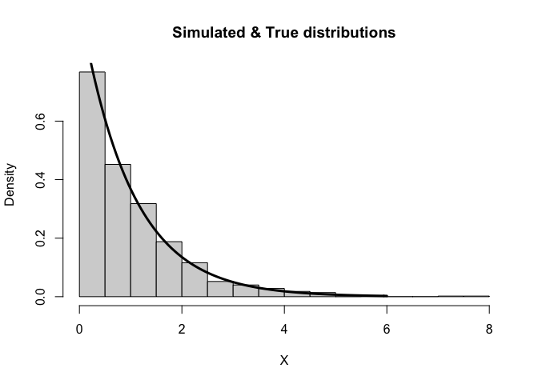

# Intuition of calibration

## Probability Integral Transform (PIT)

### Definition

Suppose that a random variable $X$ has a **continuous distribution** for which the cdf is $F_X$. Then the random variable $Y$ defined as
$$Y=F_X(X),$$
has a **standard uniform distribution**.

### Proof

$$
\begin{aligned}
F_{Y}(y) &=\mathrm{P}(Y \leq y) \\
&=\mathrm{P}\left(F_{X}(X) \leq y\right) \\
&=\mathrm{P}\left(X \leq F_{X}^{-1}(y)\right) \\
&=F_{X}\left(F_{X}^{-1}(y)\right) \\
&=y.
\end{aligned}
$$

## Inverse Transform Sampling

**Inverse Transform Sampling** aims to apply the inverse of the PIT to convert uniform random variables to any other desired random variable. It is a method for generating random numbers from desired pribability distribution.

### Discrete Random Number Generators

Assume that $X$ is a discrete random variable such that $P\left(X=x_{i}\right)=p_{i}$. The algorithm proceeds as follows:

1. Generate a random number $U \sim \operatorname{Unif}(0,1)$;
2. Determine the index $k$ using a *search* such that $\sum_{j=1}^{k-1} p_{j} \leq U<\sum_{j=1}^{k} p_{j}$, and return $X=x_{k}$.

**Example.** Simulate a discrete random variable $X$ that follows the following distribution:


| x_i| P(X=x_i)|
|---:|--------:|
|   1|      0.2|
|   2|      0.1|
|   3|      0.3|
|   4|      0.4|


```r
discrete.sample <- function(n, x, p){
  # n: number of generated samples
  # x: a vector of x values
  # p: a vector of probabilities of corresponding x values
  p_sum <- cumsum(p)
  sample_out <- numeric(n)
  for (i in seq_len(n)){
    counter <- 1
    u <- runif(1)
    while(u > p_sum[counter]){
      counter <- counter + 1
    }
    sample_out[i] <- x[counter]
  }
  return(sample_out)
}

n <- 1000
x_i <- c(1,2,3,4)
p_i <- c(0.2,0.1,0.3,0.4)
dsamples <- discrete.sample(n, x_i, p_i)

par(mfrow = c(1,2))
barplot(table(dsamples)/n, main = "Simulations")
barplot(p_i, main = "True distribution")
```

<!-- -->


### Continuous Random Number Generators

Assume that $X$ is a continuous random variable with cdf $F_X$. The algorithm proceeds as follows:

1. Generate a random number $U \sim \operatorname{Unif}(0,1)$;
2. Let $X=F_{X}^{-1}(U)$.

Note that the algorithm works in general but is not always practical because of the difficulty in calculating $F_{X}^{-1}$.

**Example.** Simulate an Exponential(1) random variable.

$$
\begin{aligned}
&F(x)=1-e^{-x}, \quad x>0; \\
&U \sim Unif(0,1); \\
&X=F^{-1}(U)=-\ln (1-U). \\
\end{aligned}
$$


```r
n <- 1000
U <- runif(n)
csamples <- X <- -log(1-U)

hist(csamples, freq = FALSE, xlab = "X", main = "Simulated & True distributions")
curve(dexp(x, rate = 1), 0, 6, lwd = 3, xlab = "", ylab = "", add = TRUE)
```

<!-- -->

## Calibration

- **Calibration** concerns the statistical consistency between the probabilistic forecasts and the corresponding realizations, and thus serves as a joint property of forecasts and observations.

- In practice, a **PIT histogram** is commonly employed informally as a diagnostic tool to assess the calibration of density forecasts. It is going the **opposite** direction to the the way to conduct random number generation.

- A **uniform** histogram indicates a probabilistically **calibrated** forecast.


```r
n <- 1000
mu <- 0
sigma <- 1
sigma_1 <- sqrt(2)
sigma_2 <- sqrt(0.5)
mu_3 <- -1
mu_4 <- 1
x <- rnorm(n, mu, sigma)

f <- pnorm(x, mu, sigma)
f_1 <- pnorm(x, mu, sigma_1)
f_2 <- pnorm(x, mu, sigma_2)
f_3 <- pnorm(x, mu_3, sigma)
f_4 <- pnorm(x, mu_4, sigma)

attach(mtcars)
layout(matrix(c(1,1,2,3,4,5), 3, 2, byrow = TRUE))
hist(f, xlab = "PIT", main = "N(0,1)")
hist(f_1, xlab = "PIT", main = "Overdispersed/Underconfident N(0, 2)")
hist(f_2, xlab = "PIT", main = "Underdispersed/Overconfident N(0, 0.5)")
hist(f_3, xlab = "PIT", main = "Left-biased N(-1, 1)")
hist(f_4, xlab = "PIT", main = "Right-biased N(1, 1)")
```

<!-- -->
