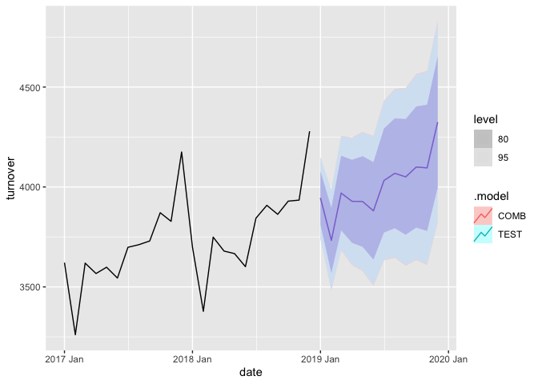

# Ensembles and combinations

## Ensembles: mixture of distributions

The ensemble probability forecast can be defined as a convex mixture of individual distributions (linear pooling).
$$
\tilde{p}\left(y_{t+h} \mid I_{t}\right)=\sum_{i=1}^{N} w_{t+h \mid t, i} p_{i}\left(y_{t+h} \mid I_{t}\right). \qquad  (1)
$$

- **Nonlinear pooling**: takes transformations to either the component forecasts or the linearly pooled forecast in order to restore calibration and sharpness.

- **Bayesian Model Averaging (BMA)**: replaces $w_{t+h \mid t, i}$ with the posterior probability of model $i$.

- Nonlinear pooling and BMA methods can be regarded as **generalizations** of linear pooling.

When is an ensemble equivalent to a combination?

- **Ensemble** involves $\color{blue}{\text{mixing}}$ the forecast distributions from multiple models, $\color{blue}{\text{ignoring correlations}}$ between distributions.

- **Combination** involves $\color{blue}{\text{averaging}}$ the forecast distributions from multiple models, $\color{blue}{\text{taking account of correlations}}$ between individual distributions.

- **If** the only difference between the two is whether to consider the **correlation** among individual distributions,
  - they will take the **same form** in Equation (1) with different ways of determining weights.
  - the characteristics of the ensemble and combined probability forecasts are same given the weights.
  - the ways of aggregating point forecasts can also be divided into ensembles and combinations according to whether the correlation is considered.

So, what does the **average** of forecast distributions (combination) represent?

## Combinations: average of variables

When considering **two** individual models, `fable` yields combined distribution (the time and horizon subscripts are dropped for simplicity) $\color{red}{\checkmark}$
$$
\tilde{Y} \sim N\left(w_{1}\mu_{1} + w_{2}\mu_{2}, w_{1}^{2}\sigma_{1}^{2} + w_{2}^{2}\sigma_{2}^{2}+2w_{1}w_{2}\rho_{12}\sigma_{1}\sigma_{2}\right), \\
Y_{1} \sim N(\mu_{1}, \sigma_{1}^{2}) \\
Y_{2} \sim N(\mu_{2}, \sigma_{2}^{2}) \\
$$
where $Y_{1}$ and $Y_{1}$ are individual forecasts, **$\rho_{12}$ is obtained by computing the correlation between (response) residuals**. The combined distribution has the same form with the **weighted sum/average of correlated variables** $Y_{1}$ and $Y_{2}$ (jointly normally distributed):
$$
\tilde{Y} = w_{1}Y_{1} + w_{2}Y_{2}.
$$
The form is similar with the point forecast combination but $Y_{1}, Y_{2}$ and $\tilde{Y}$ are **random variables** here.

So we extend the weighted average of two correlated variables in the sense of considering a larger number of individual models. The generalized form of combination is
$$
\begin{aligned}
&\tilde{Y} = \sum_{i}^{N} w_{i}Y_{i}, \qquad Y_{i} \sim N(\mu_{i}, \sigma_{i}^{2}) \\
\text{where} \quad & \tilde{Y} \sim N(\tilde{\mu}, \tilde{\sigma}^{2}) \\
&\tilde{\mu} = \sum_{i=1}^{N} w_{i} \mu_{i} \\
& \tilde{\sigma}^2 = \sum_{i=1}^{N} w_{i}^{2}\sigma_{i}^{2} + 2 \sum_{1 \leq i} \sum_{<j \leq N}w_{i} w_{j}Cov(Y_{i},Y_{j})\\
& \quad = \sum_{i=1}^{N} w_{i}^{2}\sigma_{i}^{2} + 2 \sum_{1 \leq i} \sum_{<j \leq N} w_{i} w_{j}\rho_{ij}\sigma_{i}\sigma_{j} \\
&\rho_{ij} \quad \text{is the correlation between individual residuals.}
\end{aligned}
$$

## Ensembles VS Combinations

- The **ensemble** probability forecast has the mean and variance
$$
\begin{aligned}
&\tilde{\mu}=\sum_{i=1}^{N} w_{i} \mu_{i}, \\
&\tilde{\sigma}^{2}=\sum_{i=1}^{N} w_{i} \sigma_{i}^{2}+\sum_{i=1}^{N} w_{i}\left(\mu_{i}-\tilde{\mu}\right)^{2} .
\end{aligned}
$$

- The characteristics of the mixed (ensemble) and averaged (combined) forecasts are **different**, with the exception of the **means**.

- A **point forecast** is commonly interpreted as the **mean** of the forecast distribution.

- Then the point forecast obtained from an ensemble is **equal** to that obtained from a combination when considering the same weights. So we only have 'point forecast combination' section.

# Combinations in fable

Combinations in the `fable` R package are achieved using the `combination_model()` function.


```r
combination_model <- function(..., 
                              cmbn_fn = combination_ensemble, # combination function
                              cmbn_args = list() # the additional argument passed to cmbn_fn
                              ){}
```

## Combination weights

The `cmbn_args` argument only supports two options: `list(weights = "equal")` and `list(weights = "inv_var")`.

- `cmbn_args` can include more options, such as a numerical vector of weights the same length as input models.

- `list(weights = "inv_var")` calculates the combination weights using **innovation** residuals (residuals on the transformed scale) obtained from individual models, while correlations are computed using **response** residuals. Calculating weights using **innovation** residuals or **response** residuals leads to a big difference.


```r
ft <- train %>%
  model(
    ETS = ETS(turnover),
    ARIMA = ARIMA(turnover ~ pdq(d=1) + PDQ(D=1)),
    COMB = combination_model(ETS(turnover),
                             ARIMA(turnover ~ pdq(d=1) + PDQ(D=1)),
                             cmbn_args = list(weights = "inv_var"))
  )

# innovation residuals
## c(ft$COMB[[1]]$fit$e1$fit$e1, ft$COMB[[1]]$fit$e2$fit$e1) = c(0.9999999, 9.365227e-08)
cbind(residuals(ft$ETS[[1]])$.resid, 
      residuals(ft$ARIMA[[1]])$.resid) %>% head()
```

```
##              [,1]      [,2]
## [1,] -0.011777718 1.1048749
## [2,] -0.010180908 0.3673136
## [3,]  0.015371589 0.4379756
## [4,]  0.015793168 0.3113667
## [5,]  0.010930845 0.2832091
## [6,]  0.001251772 0.1790723
```

```r
# response residuals
cbind(residuals(ft$ETS[[1]], type = "response")[[".resid"]],
      residuals(ft$ARIMA[[1]], type = "response")[[".resid"]]) %>% head()
```

```
##            [,1]      [,2]
## [1,] -22.807641 1.1048749
## [2,] -17.999844 0.3673136
## [3,]  30.030997 0.4379756
## [4,]  30.575952 0.3113667
## [5,]  21.680451 0.2832091
## [6,]   2.429903 0.1790723
```


## Combining more than two individual models

- Changing the **order** of individual models in the `combination_model()` function will produce $\color{red}{\text{different}}$ combination results (variance).


```r
# ETS is not included because of its dominant weight

# equally weighted combination
fc_s <- train %>%
  model(
    COMB_NAS = combination_model(NAIVE(turnover),
                                 ARIMA(turnover ~ pdq(d=1) + PDQ(D=1)),
                                 SNAIVE(turnover),
                                 cmbn_args = list(weights = "equal")),
    COMB_NSA = combination_model(NAIVE(turnover),
                                 SNAIVE(turnover),
                                 ARIMA(turnover ~ pdq(d=1) + PDQ(D=1)),
                                 cmbn_args = list(weights = "equal"))
  ) %>% forecast(h = 1)

# weighted combination using inv_var
fc_w <- train %>%
  model(
    COMB_NAS = combination_model(NAIVE(turnover),
                                 ARIMA(turnover ~ pdq(d=1) + PDQ(D=1)),
                                 SNAIVE(turnover),
                                 cmbn_args = list(weights = "inv_var")),
    COMB_NSA = combination_model(NAIVE(turnover),
                                 SNAIVE(turnover),
                                 ARIMA(turnover ~ pdq(d=1) + PDQ(D=1)),
                                 cmbn_args = list(weights = "inv_var"))
  ) %>% forecast(h = 1)

list(fc_s = fc_s$turnover, fc_w = fc_w$turnover)
```

```
## $fc_s
## <distribution[2]>
## [1] N(3945, 10775) N(3945, 10765)
## 
## $fc_w
## <distribution[2]>
## [1] N(3850, 5062) N(3850, 5230)
```


- Reason: combine **iteratively** $\rightarrow$ comb(comb(1, 2), 3). $\color{red}{\checkmark}$

  - Step 1:
$$
\begin{aligned}
&X = w_{1}Y_{1} + w_{2}Y_{2} \\
\text{where} \quad &\mu_{x} = \sum_{i=1}^{2} w_{i} \mu_{i} \\
& \sigma_{x}^2 = \sum_{i=1}^{2} w_{i}^{2}\sigma_{i}^{2} + 2 w_{1} w_{2}\rho_{12}\sigma_{1}\sigma_{2} \\
& \rho_{12} \quad \text{is the correlation between individual residuals} (e_{1}, e_{2}).
\end{aligned}
$$
  - Step 2: 
$$
\begin{aligned}
&Z = X + w_{3}Y_{3} \\
\text{where} \quad &\mu_{z} = \sum_{i=1}^{3} w_{i} \mu_{i} \\
& \sigma_{z}^2 = \sum_{i=1}^{3} w_{i}^{2}\sigma_{i}^{2} + 2 w_{1} w_{2}\rho_{12}\sigma_{1}\sigma_{2} + 2 w_{3} \rho_{x3}\sigma_{x}\sigma_{3} \\
& \rho_{x3} \quad \text{is the correlation between residuals} (w_{1}e_{1}+w_{2}e_{2}, w_{3}e_3).
\end{aligned}
$$

- How about using the **generalized form of combinations** (weighted average of correlated variables)?


```r
# equally weighted combination
ft <- train %>%
  model(
    NAIVE = NAIVE(turnover),
    ARIMA = ARIMA(turnover ~ pdq(d=1) + PDQ(D=1)),
    SNAIVE = SNAIVE(turnover),
    COMB = combination_model(NAIVE(turnover),
                             ARIMA(turnover ~ pdq(d=1) + PDQ(D=1)),
                             SNAIVE(turnover),
                             cmbn_args = list(weights = "equal")),
  ) 
fc <- ft %>% forecast(h = "1 year")

# combinations in fable
combination_fable <- fc %>%
  filter(.model=="COMB") %>%
  as_tibble() %>%
  select(date,.model,turnover)

# combinations using the weighted average of correlated variables
weights_type <- "equal" # "equal" or "inv_var"
if(weights_type == "equal"){
  weights <- rep(1/3, 3)
} else{
  # weights are obtained using (innovation) residuals
  inv_var <- c(1/var(residuals(ft$NAIVE[[1]])$.resid, na.rm = TRUE),
               1/var(residuals(ft$ARIMA[[1]])$.resid, na.rm = TRUE),
               1/var(residuals(ft$SNAIVE[[1]])$.resid, na.rm = TRUE))
  weights <- inv_var/sum(inv_var)
}

## correlation among individual (response) residuals
resid_naive <- residuals(ft$NAIVE[[1]], type = "response")[[".resid"]]
resid_arima <- residuals(ft$ARIMA[[1]], type = "response")[[".resid"]]
resid_snaive <- residuals(ft$SNAIVE[[1]], type = "response")[[".resid"]]
ft_cov <- var(cbind(resid_naive,resid_arima,resid_snaive), na.rm = TRUE)
ft_cor <- cov2cor(ft_cov)

## combined distributions
fc_dist_naive <- fc$turnover[1:12]
fc_dist_arima <- fc$turnover[13:24]
fc_dist_snaive <- fc$turnover[25:36]
fc_dist_comb <- fc$turnover[37:48] # combination_fable
mu_naive <- mean(fc_dist_naive)
mu_arima <- mean(fc_dist_arima)
mu_snaive <- mean(fc_dist_snaive)
mu_comb <- mean(fc_dist_comb)
var_naive <- variance(fc_dist_naive)
var_arima <- variance(fc_dist_arima)
var_snaive <- variance(fc_dist_snaive)
var_comb <- variance(fc_dist_comb)

## modified combined distributions
mu_test <- apply(cbind(mu_naive, mu_arima, mu_snaive),
                 1,
                 function(x) weighted.mean(x, w = weights))
var_test <- weights[1]^2*var_naive + weights[2]^2*var_arima + weights[3]^2*var_snaive + 
  2 * weights[1]*weights[2] * sqrt(var_naive)*sqrt(var_arima)*ft_cor[1,2] +
  2 * weights[1]*weights[3] * sqrt(var_naive)*sqrt(var_snaive)*ft_cor[1,3] +
  2 * weights[2]*weights[3] * sqrt(var_arima)*sqrt(var_snaive)*ft_cor[2,3]

## replace with modified mean and variance
fc_test <- fc
fc_test$turnover[37:48] <- distributional::dist_normal(mu_test, sqrt(var_test))
fc_test$.model[37:48] <- rep("TEST", 12)
combination_test <- fc_test %>%
  filter(.model=="TEST") %>%
  as_tibble() %>%
  select(date,.model,turnover)

# results
fc2 <- bind_rows(combination_fable, combination_test) %>%
  mutate(.model = factor(.model, levels=c("COMB","TEST"))) %>%
  as_fable(index=date, key=.model, distribution=turnover, response="turnover")
## Combinations in fable
fc2$turnover[1:12]
```

```
## <distribution[12]>
##  [1] N(3945, 10775) N(3733, 16170) N(3970, 21375) N(3928, 26486) N(3928, 31537)
##  [6] N(3881, 36547) N(4032, 41526) N(4068, 46480) N(4051, 51414) N(4100, 56331)
## [11] N(4096, 61235) N(4324, 66125)
```

```r
## Test combinations
fc2$turnover[13:24]
```

```
## <distribution[12]>
##  [1] N(3945, 10814) N(3733, 16050) N(3970, 21147) N(3928, 26174) N(3928, 31155)
##  [6] N(3881, 36105) N(4032, 41030) N(4068, 45936) N(4051, 50826) N(4100, 55703)
## [11] N(4096, 60568) N(4324, 65424)
```

```r
# plot
fc2 %>% filter(.model=="COMB") %>% 
  autoplot(train %>% filter(year(date) >= 2017), color='red') + 
  labs(title = "Combination in fable")
```

<!-- -->

```r
fc2 %>% filter(.model=="TEST") %>% 
  autoplot(train %>% filter(year(date) >= 2017), color='blue') + 
  labs(title = "Test combination")
```

<!-- -->

```r
fc2 %>% autoplot(train %>% filter(year(date) >= 2017)) +
  autolayer(filter(fc2, .model=="COMB"), color='red', alpha = 0.3) + 
  autolayer(filter(fc2, .model=="TEST"), color='blue', alpha = 0.3)
```

<!-- -->

# Extensions

Other forms (not normally distributed) of individual distributions (random variables)

Copula + Sampling


