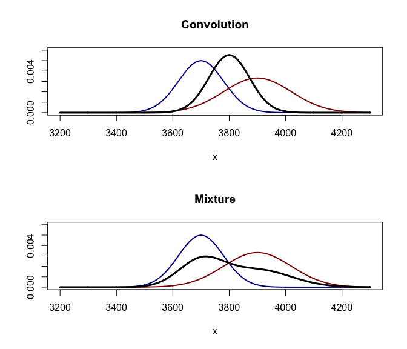

# Mixture and Convolution

Let $X_{1}, \ldots, X_{N}$ denote random variables from the $N$ component distributions, $X_{i} \sim f_i$ for $(i=1,\ldots,N)$.

- **A mixture distribution** has a density which is a weighted sum of a set of probability densities.

$$
f_{c}(x) = \sum_{i=1}^{N} w_{i} f_{i}(x).
$$

- **A convolution** gives a distribution of a random variable which is a sum of a set of random variables.

$$
f_w (x) = f_{x_1 + \ldots + x_N} (x) = (f_1*f_2*\ldots*f_N)(x).
$$

- An example: $X_1 \sim N(3700, 80)$ and $X_2 \sim N(3900, 120)$ with equal weights.

<!-- -->

- The sum of two jointly normally distributed random variables, each with different means and variances, will still have a normal distribution.

- A mixture density created as a mixture of two normal distributions with different means will have two peaks provided that the two means are far enough apart, showing that this distribution is radically different from a normal distribution.

